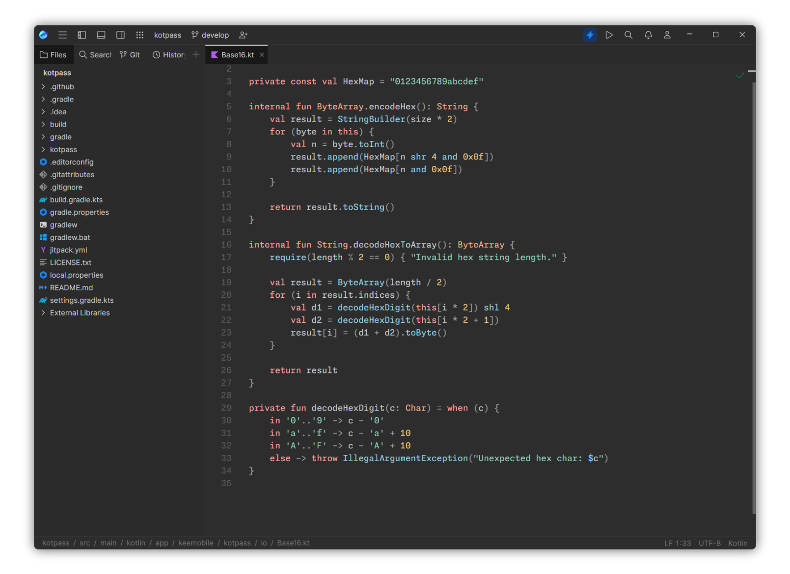

    

<h2 align="center">
	Dune theme for <a href="https://jetbrains.com/fleet">JetBrains Fleet</a>
</h2>

    

Harmonic and flow inducing color scheme which is gentle for your eyes.

### 📦 Installation

1. Open Fleet's **plugins** tab and install **Dune Theme**.
2. Launch theme chooser and activate **Arrakis Night**.

#### Manual installation
1. Put `arrakis-night.json` into `themes` folder located in `~/.fleet` or `%USERPROFILE%/.fleet` (depending on OS).

> Font used on the screenshot: [Monaspace Neon](https://monaspace.githubnext.com/).