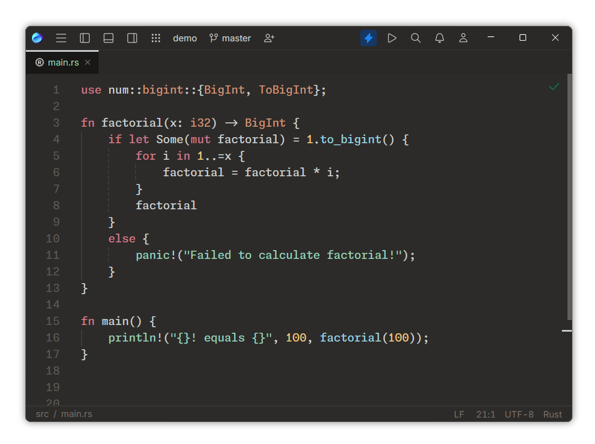

    

<h3 align="center">
	Dune theme for <a href="https://jetbrains.com/fleet">JetBrains Fleet</a>
</h3>

    

Harmonic and flow inducing color scheme which are gentle for your eyes.

### 📦 Installation

Put `themes` to the `~/.fleet` or `%USERPROFILE%/.fleet` folder depending on OS.

Font used on the screenshot: [Monaspace Neon](https://monaspace.githubnext.com/).

